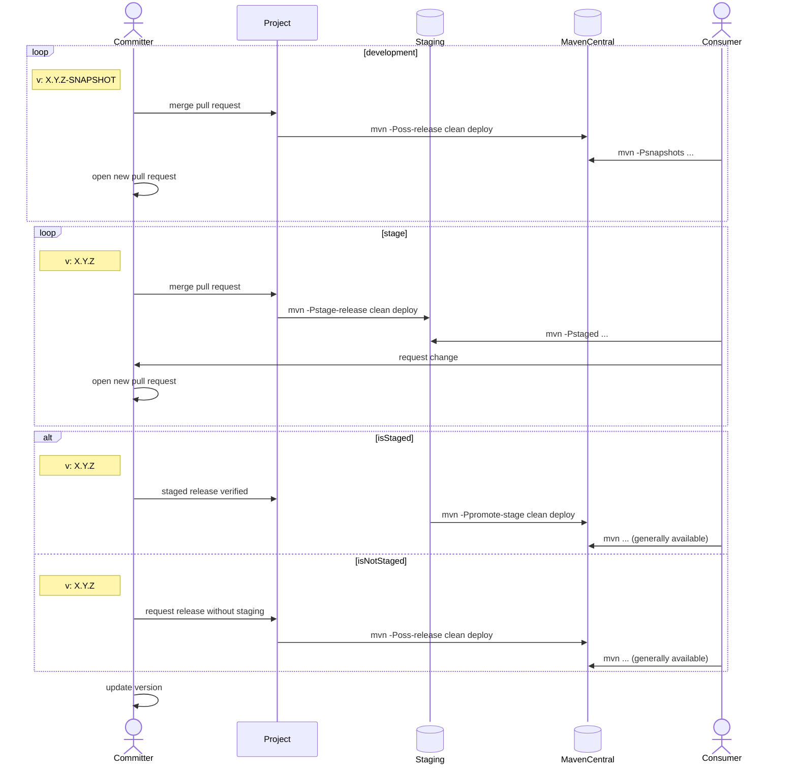

# Eclipse Enterprise for Java (EE4J)

Eclipse Enterprise for Java (EE4J) is an open source initiative to create standard APIs, implementations of those APIs, and technology compatibility kits for Java runtimes that enable development, deployment, and management of server-side and cloud-native applications.  EE4J is based on the Java™ Platform, Enterprise Edition (Java EE) standards, and uses Java EE 8 as the baseline for creating new standards.

This organization provides a home for Git repositories that implement the various APIs, TCKs, and RIs for the related specifications.

Please see the [Eclipse EE4J Project](https://projects.eclipse.org/projects/ee4j).

[EE4J/Jakarta EE Wiki](https://wiki.eclipse.org/Category:Jakarta_EE)

## Release process for EE4J projects

The following sequence diagram illustrates the release process that is supported by this project and how the various profiles are intended to be used.

